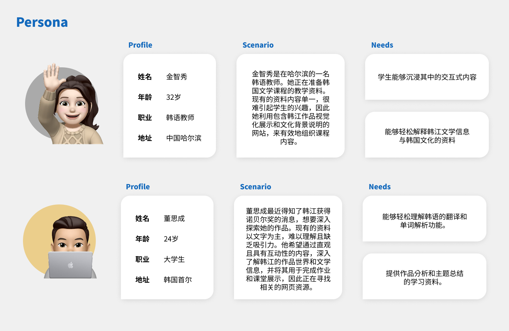
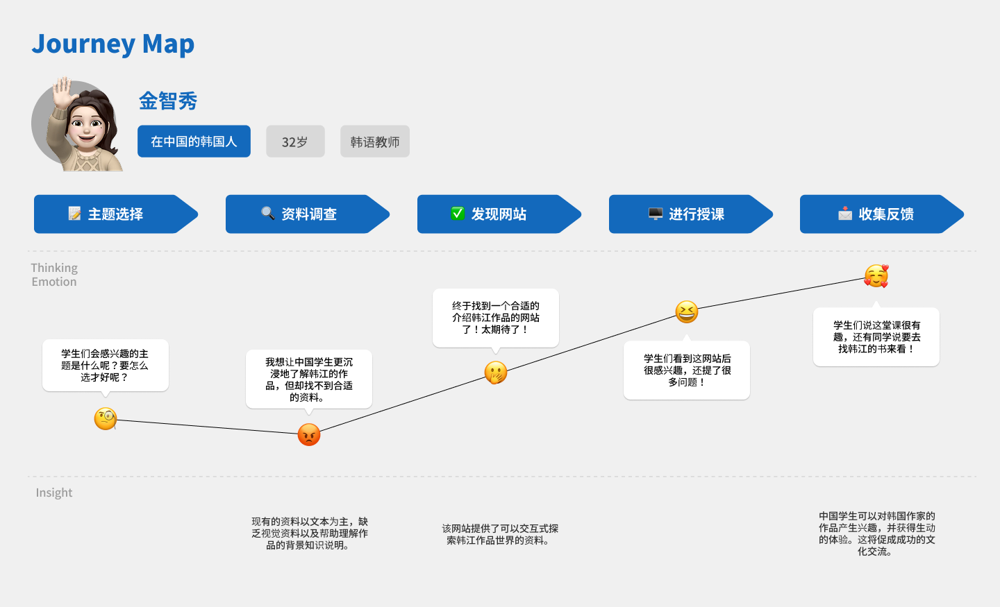
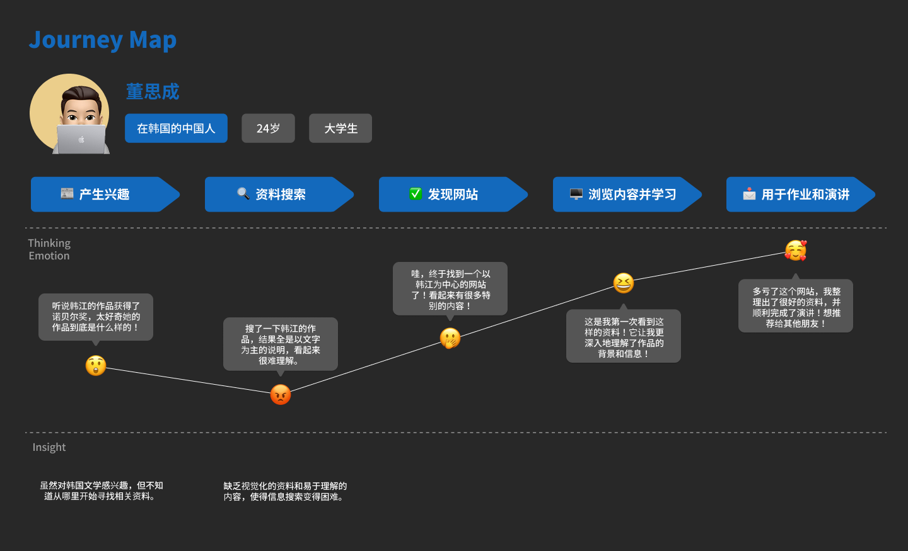
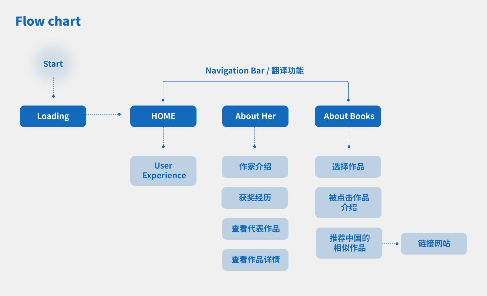

# 📝 HanKang_WEB
基于React的韩江及其作品交互式网站的设计与实现的过程记录
 
<React 기반의 한강 작가와 그녀의 작품세계를 소개하는 인터랙티브 웹사이트 디자인 및 구현> 을 주제로 한 대학졸업작품 저장소입니다. 🔍

 

## 🛠️ Tech

  

 

## 🖥️ 작품 소개

#### 사용자 정의 및 로드맵

#### 시연 영상
[링크 바로가기](https://youtu.be/J8FGLSFYMAA)